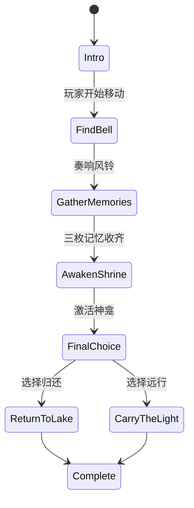

# 《微光林地：雨的名字》第一幕原始短篇设计（存档）

版本：0.1（已由长篇版取代）  
存档校准：2026-08-01  
类型：单机第三人称、唯美 3D 探索、轻环境谜题  
目标时长：15–25 分钟  
核心意象：雨滴、倒影、风铃、记忆、归还

> **历史文档，不是当前实现说明。** 本稿记录最早的单幕短篇，当时只有 6 个阶段和
> `return_to_lake`／`carry_the_light` 两种林地选择。当前 0.6.1-alpha 已扩为四幕、
> campaign v6 的 17 个阶段、跨时相机关、行灯证词、雨眼试炼以及
> `merge_memories`／`guard_boundary`／`tidal_order` 三个终局。当前事实请以
> `NARRATIVE_DESIGN.md`、`GAMEPLAY_AND_CONTROLS.md` 和自动测试为准。本页只读保留，
> 不应据此修改运行时代码或验收 Windows 包。

## 1. 一句话故事

失去名字的林灵在一场不会落下的雨中醒来，循风铃回声从湖水里找回三段记忆，
最终决定将记忆归还林地，或带着仅存的微光离开。

## 2. 主题

- 记住并不等于占有。
- 离开与归还都可能是温柔的选择。
- 环境不是背景；水、风和光本身承担叙事。

剧情不使用长篇文本解释世界观。玩家通过水面反应、环境变化、短句旁白和可交互
物体拼出故事。

## 3. 主要角色

### 无名林灵（玩家）

由林地最后一束暖光塑成的孩子。脸上的圆形印记原本记录雨的名字，但醒来时只剩
空白。无配音台词，以动作、停顿和环境回应表达情绪。

### 澜（湖的记忆）

不以实体 NPC 出现。它存在于水滴、倒影和短句旁白中。三枚记忆分别代表：

1. 雨落下时的声音。
2. 雨停下后的气味。
3. 有人曾在湖边等待。

### 林中神龛

不是神明，而是林地保存共同记忆的容器。它需要风的“钥匙”和水的三段“内容”
才能苏醒。

## 4. 全流程

### 序章：不会落下的雨（2–3 分钟）

开场由深青黑淡入。水滴悬落，湖面先于角色发出扩散环。玩家在远离神龛的路径上
醒来。

屏幕短句：

> 雨记得每一片叶子。  
> 但它忘记了如何落下。

目标：沿泥土路径向林地中心前进。

教学：

- WASD 移动。
- 鼠标观察。
- 接近风铃后出现交互提示。

环境状态：

- 神龛熄灭。
- 体积雾偏冷。
- 水面持续出现零散雨滴波纹。

### 第一章：风的钥匙（3–5 分钟）

玩家发现林间风铃。奏响后铃体摆动并发出三层泛音，青色微光沿路径短暂流向湖泊。

旁白：

> 风没有带来答案。  
> 它只把遗失的声音送回湖面。

结果：

- 任务进入“寻找三枚湖中记忆”。
- 湖岸出现三处更明显的水面呼吸/光点。
- 神龛仍不可激活。
- 自动保存。

### 第二章：湖之回声（5–8 分钟）

三枚记忆水滴分布在湖岸、浅水和神龛背后的石隙。玩家接近时水滴上下漂浮，周围
水面产生同心环。

收集顺序不限：

1. **声音**：靠近湖岸风口；收集后环境加入更清晰的水滴声。
2. **气味**：位于浅水区；玩家涉水产生脚步波纹。
3. **等待**：位于神龛后的石隙；收集后出现最暖的一束光。

每次收集显示一句记忆：

- “第一场雨落下时，林地学会了倾听。”
- “潮湿的泥土曾替所有离去的人保存春天。”
- “湖边没有等来谁，却一直留着一盏灯。”

三枚收齐：

- 水面扩散一次大型低幅波纹。
- 神龛核心由暗绿变为低亮青色。
- 任务进入“唤醒林中神龛”。
- 自动保存。

### 第三章：记忆容器（3–5 分钟）

玩家返回并触摸神龛。角色播放 Interact 动画；神龛发出低频和弦，Emission、
OmniLight、Glow 与水面反射依次增强。

旁白：

> 你终于想起：  
> 被雨忘记的不是名字。  
> 是它该流向哪里。

神龛苏醒后出现两枚选择之光。

### 终章：归还或远行（2–4 分钟）

#### 选择 A：归还湖水

交互文本：“将记忆归还湖水”。

表现：

- 三枚光从角色印记流向湖心。
- 大型波纹扩散至整片湖面。
- 雾转暖，雨滴恢复自然落下。

结尾：

> 你没有留下名字。  
> 从此，每一场雨都替你回答。

结局 ID：`return_to_lake`

#### 选择 B：带走微光

交互文本：“带着微光离开林地”。

表现：

- 角色印记变为暖金色。
- 神龛维持微弱青光。
- 通向远雾的路径亮起，雨在身后落下。

结尾：

> 林地失去了一段记忆。  
> 世界却多了一盏会行走的灯。

结局 ID：`carry_the_light`

两个结局均不是善恶判断。选择后保存结局 ID，并允许从标题界面重新开始。

## 5. 任务状态机



稳定状态 ID：

```text
intro
find_bell
gather_memories
awaken_shrine
final_choice
complete
```

## 6. 运行时事件

| 语义事件 | 来源 | 叙事结果 |
|---|---|---|
| `bell_rung` | WindBell | 进入记忆收集阶段 |
| `memory_collected(id)` | MemoryDroplet | 增加收集数并播放对应短句 |
| `all_memories_collected` | NarrativeDirector | 解锁神龛 |
| `shrine_activated` | Shrine | 进入最终选择 |
| `ending_selected(id)` | EndingChoice | 锁定结局并播放结尾 |

场景对象只发语义事件；`NarrativeDirector` 决定章节与任务文本，`Main` 负责连接视觉
对象，避免把剧情规则重新堆回 Player 或 Shrine。

## 7. 存档节点

- 奏响风铃后。
- 每枚记忆收集后。
- 神龛唤醒后。
- 最终选择后。

存档字段：

```text
narrative.stage
narrative.memory_ids
narrative.ending_id
world_state[persistent_id]
player_position
```

所有步骤均可从中途恢复，不依赖一次性 Tween 是否已经播放。

## 8. 美术与灯光进程

| 阶段 | 雾/天空 | 神龛 | 水面 | 主色 |
|---|---|---|---|---|
| 序章 | 冷、低对比 | 熄灭 | 零散水滴环 | 灰青绿 |
| 风铃后 | 略提亮 | 暗青 | 光点指引 | 青绿 |
| 记忆齐全 | 暖光进入 | 低亮核心 | 大型呼吸波 | 青+暖金 |
| 神龛后 | 对比增强 | 强青光 | SSR 高光增强 | 青/金 |
| 归还结局 | 暖雾 | 稳定青光 | 全湖扩散环 | 清澈青绿 |
| 远行结局 | 远景暖 | 微弱 | 身后落雨 | 暖金+雾青 |

## 9. 完成定义

全流程版本必须满足：

1. 从新游戏开始可以无开发者操作完成所有章节。
2. 三枚记忆可任意顺序收集，不能重复计数。
3. 未收齐记忆时神龛不可激活。
4. 神龛激活后只能选择一个结局。
5. 每个检查点均能保存、退出并恢复。
6. 两个结局都有明确文字、视觉反馈和稳定结局 ID。
7. 水滴与涉水波纹在实际 Vulkan Forward+ 运行中可见。
8. 自动测试覆盖状态机主路径、乱序收集、重复事件和恢复状态。
