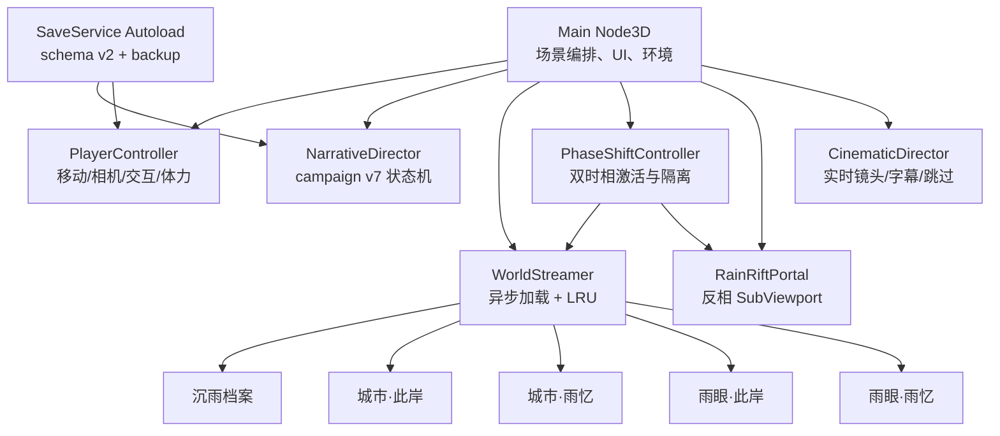

# 《微光林地：雨的名字》技术设计

版本：0.6.2-alpha
基线：Godot 4.7.1 Stable、Forward+、Jolt Physics  
校准日期：2026-08-01

## 1. 文档范围

本文只描述当前工程已经存在的结构。未来的 QuestService、组件化 Player、独立音频总线、
NavMesh、战斗或联网系统不再写进“当前架构”；它们如有需要，只能列在计划章节。

## 2. 运行架构



主场景 `game/main/main.tscn` 只有一个根 Node3D，绝大多数第一幕环境由
`game/main/main.gd` 程序化创建。后续章节由 WorldStreamer 实例化独立场景。

## 3. 真实目录

```text
game/
├── project.godot
├── export_presets.cfg
├── core/
│   ├── audio/procedural_tone.gd
│   ├── cinematic/cinematic_director.gd
│   ├── save/save_service.gd
│   └── world_streamer/world_streamer.gd
├── game/
│   ├── interaction/          # 风铃、神龛
│   ├── main/                 # 运行时编排
│   ├── narrative/            # 状态机、锚点、回路、配重、选择
│   ├── player/               # Player 场景、控制器、材质增强
│   └── world/                # 水面、时相控制、门户、可推动刚体
├── content/
│   ├── characters/
│   ├── environments/
│   ├── levels/
│   │   ├── echo_ruins/
│   │   ├── lantern_city/
│   │   └── rain_eye/
│   ├── materials/
│   ├── props/
│   └── vfx/
├── shaders/realistic_lake.gdshader
├── tests/                    # 发布包排除
└── tools/                    # 发布包排除
```

## 4. 主线状态机

NarrativeDirector 是唯一的剧情真相源，不另设不存在的 QuestService。

```text
intro
→ find_bell
→ gather_memories
→ awaken_shrine
→ memory_alignment
→ rift_ready
→ archive_search
→ archive_mechanisms
→ archive_restored
→ city_gate
→ lantern_city
→ city_relays
→ city_council
→ rain_eye
→ rain_eye_trials
→ final_decision
→ complete
```

集合型进度全部保存稳定 StringName ID：

- `memory_ids`：3 个；
- `archive_anchor_ids`：3 个；
- `archive_mechanism_ids`：3 个且严格有序；
- `city_trace_ids`：3 个；
- `city_relay_ids`：4 个且严格有序；
- `rain_eye_seal_ids`：3 个；
- `rain_eye_trial_ids`：3 个且严格有序。

`alignment_id` 与 `city_testimony_id` 决定潮汐结局是否开放；`ending_id` 只在最终选择后写入。
campaign 版本是 6。

## 5. 玩家控制器

当前 PlayerController 是一个脚本，不虚构 MovementComponent 等不存在节点。它负责：

- CharacterBody3D 加速、减速、重力、跳跃和 floor snap；
- 步行 5 m/s、冲刺 8 m/s；
- 100 点体力、24 点/秒消耗、19 点/秒恢复；
- 鼠标与右摇杆相机、SpringArm 遮挡；
- 冲刺 FOV 与轻微镜头步幅；
- 中央射线交互和 3.2 m 距离；
- Idle / Walk / Run / Jump / Fall / Land / Interact AnimationTree；
- 最近交互点检查点和 y < -6.5 掉落恢复。

七个状态均使用独立动画；位移仍由 `CharacterBody3D` 驱动，不使用 Root Motion。

## 6. 交互模型

交互对象加入 `interactable` group，并至少实现：

```gdscript
func can_interact(actor: Node) -> bool
func get_prompt(actor: Node) -> String
func interact(actor: Node) -> void
```

主要实现：

- WindBell、Shrine、MemoryDroplet；
- ArchiveAnchor、CityTrace、EndingChoice；
- StoryResonator：档案透镜、城市行灯、雨眼试炼的通用节点；
- PushableMemoryStone：交互时按玩家到物体方向施加 Jolt 冲量；
- JoltCounterweightPlate：Area3D 检测指定刚体 group 后完成机关；
- CityGate：章节交接入口。

可用性由 NarrativeDirector 当前阶段和 next ID 决定。节点自身不擅自推进主线。

## 7. 双时相与流送

正常运行只保留当前章节的两个完整场景；章节交接时临时提高到 3，激活新主场景后立即驱逐旧场景，
再恢复到 2。

| 阶段 | 此岸 | 雨忆 |
|---|---|---|
| 第一、二幕 | 程序化林地 | `echo_ruins.tscn` |
| 第三幕 | `lantern_city_present.tscn` | `lantern_city_echo.tscn` |
| 第四幕 | `rain_eye_present.tscn` | `rain_eye_echo.tscn` |

WorldStreamer 使用 threaded request、逐帧轮询、`CACHE_MODE_IGNORE` 和 LRU。非活动世界视觉仍可供门户
读取，但 process mode 和碰撞关闭。主相机 cull mask 与门户相机 cull mask 相反。

详见 `STREAMING_AND_PORTAL_ARCHITECTURE.md`。

## 8. 渲染

### 高画质默认档

- PhysicalSky、Filmic；
- SSR、SSAO、SSIL、SDFGI；
- 体积雾、普通雾、Glow；
- 45 m 方向光阴影；
- 4K runtime PBR 环境纹理与各向异性过滤（8K 英雄源文件外置）；
- 水面顶点波、法线、反射感、焦散和交互涟漪；
- 角色皮肤 SSS、眼睛 Clearcoat、头发 Anisotropy；
- 雨、悬浮水滴、花瓣、萤火和雨眼风暴粒子。

### 可切换档位

均衡档关闭 SSIL/SDFGI；性能档进一步关闭 SSR 和体积雾。切换只改变环境特性开关和阴影距离，
不替换或破坏材质资源。

### 门户

门户使用 640×360 SubViewport。可见时按距离自适应更新；不可见时停止；预览相机只渲染相反层。
这不是另一份世界副本，复用已驻留场景。

## 9. 物理

`project.godot` 固定：

```text
3d/physics_engine = Jolt Physics
3d/run_on_separate_thread = true
common/enable_physics_interpolation = true
```

层定义：

| 层 | 用途 |
|---:|---|
| 1 | 世界静态/动态碰撞 |
| 2 | 玩家 |
| 3 | 交互射线目标 |

可推动记忆石同时位于世界和交互层。压力板只监测世界层，并额外核对
`archive_counterweight` group，避免玩家身体直接完成机关。

## 10. 过场与 UI

CinematicDirector 创建一台独立 Camera3D，执行 shot 字典中的位置、look-at、FOV、时长和字幕。
播放时关闭玩家控制，支持 Enter/B 跳过，结束后恢复游戏相机。

当前有开场、神龛、档案进入/复原、城市到达、雨眼进入、最终决定和三个尾声序列。

UI 全部运行时构建：地区、幕名、目标、战役进度、toast、体力、交互提示、过场黑边、结局层、
暂停菜单和画质按钮。

## 11. 保存

SaveService 是唯一 autoload。schema v2 payload：

```json
{
  "schema_version": 2,
  "build_version": "0.6.2-alpha",
  "saved_at_unix": 0,
  "current_level_id": "luminous_grove",
  "player_position": [0, 1, 0],
  "player_rotation": [0, 0, 0],
  "world_state": {}
}
```

写入顺序：临时文件 → 关闭并重读验证 → 复制旧主档为 backup → 删除旧主档 → 原子 rename。
主档存在但无效时读取 backup。schema v1 自动补齐版本、时间戳和旋转；campaign < 6 自动填充旧版本
已经跨过的新玩法节点，避免老玩家倒退。

## 12. Windows 构建

- 目标：Windows Desktop x86_64；
- 模板：Godot 4.7.1 官方 `windows_release_x86_64.exe`；
- 纹理：S3TC/BPTC 开启，ETC2/ASTC 关闭；
- 资源：EXE 与独立 PCK；
- 排除：tests、tools、source_art、旧 spirit_child 和未使用源贴图；
- 当前不签名、不加密 PCK、不制作安装器。

独立 PCK 便于校验与修补，也避免把 100+ MiB 数据嵌进 PE 后难以定位问题。

## 13. 已验证的不变量

- 23 项回归全部通过；
- 100 次时相切换后无重复场景；
- 章节交接后完整关卡常驻数为 2；
- Jolt 配重由真实刚体进入 Area 触发；
- 三结局与潮汐锁定条件可重复验证；
- 完成态保存可直接恢复到雨眼双场景；
- 高画质档在 Renoir + RADV 上通过真实 Vulkan 表面运行。

## 14. 明确技术债

- `main.gd` 仍承担过多场景编排和 UI 构建，下一轮应拆成 CampaignOrchestrator、HUDController、
  QualityController。
- 第一幕环境高度程序化，长期应转为可编辑场景块和 MultiMesh。
- 缺少正式 Run/Jump/Land 动作、IK、脚底贴地和面部动画。
- 缺少音频总线、空间混响、配音和动态混音。
- 缺少按键重映射、字幕缩放和完整无障碍设置。
- Windows 包未签名，且尚需真实 Windows 硬件人工验收。
